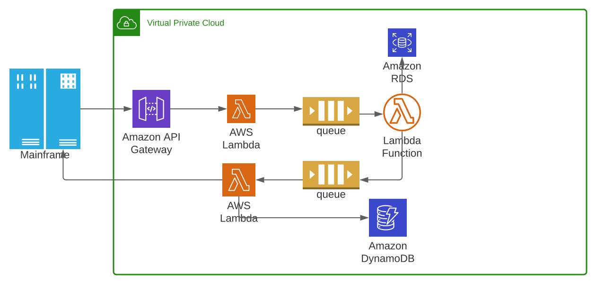

# Learn and Share Event Based Design

## Preface

This Project is to create a **Event Driven Architecture**, a key architectural principle,
and build infrastructure and services to react in response to events and to structure code/functions on this basis.

Core principles of the development are:

1. can scale and fail independently 🚀
1. are developed with agility (decoupled) 🏃
1. are ease of audit 🔍
1. can stop processing same message twice
1. help to cut costs via scale to zero with lambda 💲
1. leverage asynchronous processing and 🔛
1. support customer integration 🤝

## Architecture View

> Architect and Developer perspective
>
> - includes the 3 main functions (development, run-time and administration),
> - targets primarily the automated event processing operations
>
> Run-time functions in 2 main groups:
> - the event infrastructure (sources and consumers) external to the event processor under consideration,
> - the event processor. 

>Event Production: the source of events for event processing.
>
> • Event Publication: As a part of event production, events may be published onto a communication mechanism (e.g., event bus) for use by event consumers (including participants in event processing). This is analogous to a "push" system for obtaining events.
> • Event Retrieval: As a part of event production, events may be explicitly retrieved from some detection system. This is analogous to a "pull" system for obtaining events.

>Event Consumption: the process of using events from event publication and processing. Event processing itself can be an event consumer, although for the purposes of the reference architecture, event consumers are meant to indicate downstream consumers of events generated in event processing.
>
> • Dashboard: a type of event consumer that displays events as they occur to some user community.
> • Applications: a type of event consumer if it consumes events for its own processes.
> • External Reaction: caused through some event consumption, as the result of some hardware or software process. 

> Event Preparation: the process of preparing the event and associated payload and metadata for further stages of event processing.
> • Entity Identification: incoming events will need to be identified relative to prior events, such as associating events with particular sources or sensors.
> • Event Selection: particular events may be selected for further analysis. Different parts of event processing may require different selections of events. See also event filtering.
> • Event Filtering: a stream or list of events may be filtered on some payload or metadata information such that some subset is selected for further processing.
> • Event Monitoring: particular types of events may be monitored for selection for further processing. This may utilise specific mechanisms external to the event processing such as exploiting event production features.
> • Event Enrichment: events may be "enriched" through knowledge gained through previous events or data. 

## Implementation View
Following sequence diagram shows them in action:

> High Level Processing.
>
> - Event Notifier will publish a JOSN message on API GateWay. 
> - API Gateway will invoke Lambda function.
> - Lambda Function will store message in DB and publish a topic.
> - SNS will read tpoic and invoke another Lambda Function.
> - This Lamda will pull full data from producer and store in Dynamo DB
